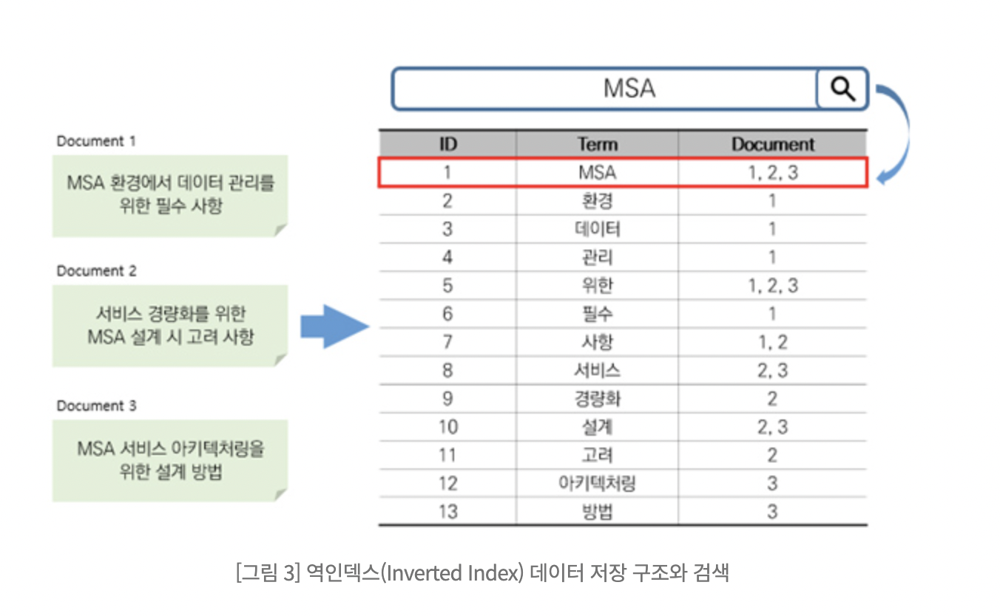

## 1. Elastic-Search란

모든 데이터를 색인하여 저장하고 검색, 집계 등을 수행하며 결과를 클라이언트 또는 다른 프로그램으로 전달하여 동작하게 합니다.

기존 관계 데이터베이스 시스템에서는 다루기 어려운 전문검색(Full Text Search) 기능과 점수 기반의 다양한 정확도 알고리즘, 실시간 분석 등의 구현이 가능합니다.

## 2. Elastic-Search의 특징

- **오픈소스 (open source)**
- **실시간 분석 (real-time)**
- **전문(full text) 검색 엔진**
- **RESTFul API**
- **멀티테넌시 (multitenancy)**
  - Elasticsearch의 데이터들은 인덱스(Index) 라는 논리적인 집합 단위로 구성되며 서로 다른 저장소에 분산되어 저장됩니다. 서로 다른 인덱스들을 별도의 커넥션 없이 하나의 질의로 묶어서 검색하고, 검색 결과들을 하나의 출력으로 도출할 수 있는데, Elasticsearch의 이러한 특징을 멀티테넌시 라고 합니다.

## 3. Elastic-Search 용어

- **[동사] 색인 (indexing)** : 데이터가 검색될 수 있는 구조로 변경하기 위해 원본 문서를 검색어 토큰들으로 변환하여 저장하는 일련의 과정입니다. 이 책에서는 색인 또는 색인 과정이라고 표기합니다.
- **[명사] 인덱스 (index, indices)** : 색인 과정을 거친 결과물, 또는 색인된 데이터가 저장되는 저장소입니다. 또한 Elasticsearch에서 도큐먼트들의 논리적인 집합을 표현하는 단위이기도 합니다. 이 책에서는 인덱스라고 표기합니다.
- **검색 (search)** : 인덱스에 들어있는 검색어 토큰들을 포함하고 있는 문서를 찾아가는 과정입니다.
- **질의 (query)** : 사용자가 원하는 문서를 찾거나 집계 결과를 출력하기 위해 검색 시 입력하는 검색어 또는 검색 조건입니다. 이 책에서는 질의 또는 쿼리라고 표현합니다.

## 4. Elastic-Search가 왜 빠른가?

### Elastic-Search는 주어진 검색어에 대해서 모든 열을 찾아보는 대신에, 인덱스(색인)를 이용해서 어떤 문서나 열에 해당되는지 찾을 수 있습니다.

mysql의 경우 모든 항목에서 해당 검색어가 있는지 확인하는 방법을 사용합니다.

하지만 Elastic-Search는 저장 할 때부터 색인 기능을 통해 저장해 검색어 안에 있는 내용을 가져옵니다.





그림과 같이 document 1,2,3 을 저장하고 “MSA” 를 검색할 경우

term에서 “MSA”를 찾아 저장된 document의 번호를 불러옵니다.

그래서 다른 과정을 걸치지 않아 mysql보다 훨신 빠릅니다.

## 5.  Elastic-Search는 그러면 어떠한 기준으로 문자를 나누는가

### Elastic-Search는 analyzer 를 통해 나눕니다.

- 먼저 기본 standard 형태는 공백을 기준으로 나눕니다.

    ```
    GET _analyze
    {
    	"analyzer" : "standard",
    	"text" : "허상의 멋진 어릿광대"
    }
    ```

  결과

    ```json
    {
      "tokens": [
        {
          "token": "허상의",
          "start_offset": 0,
          "end_offset": 3,
          "type": "<HANGUL>",
          "position": 0
        },
        {
          "token": "멋진",
          "start_offset": 4,
          "end_offset": 6,
          "type": "<HANGUL>",
          "position": 1
        },
        {
          "token": "어릿광대",
          "start_offset": 7,
          "end_offset": 11,
          "type": "<HANGUL>",
          "position": 2
        }
      ]
    }
    ```

  허상의 처럼 조사가 붙어 허상이라고 검색하면 찾지 못하는 문제가 발생합니다.

  그래서 한글에 경우 다른 analyzer를 사용합니다.

- 한글에 특화된 nori가 있습니다.

    ```
    GET _analyze
    {
      "analyzer": "nori",
      "text": "허상의 멋진 어릿광대"
    }
    ```

  결과

    ```json
    {
      "tokens": [
        {
          "token": "허상",
          "start_offset": 0,
          "end_offset": 2,
          "type": "word",
          "position": 0
        },
        {
          "token": "멋지",
          "start_offset": 4,
          "end_offset": 6,
          "type": "word",
          "position": 2
        },
        {
          "token": "어릿",
          "start_offset": 7,
          "end_offset": 9,
          "type": "word",
          "position": 4
        },
        {
          "token": "광대",
          "start_offset": 9,
          "end_offset": 11,
          "type": "word",
          "position": 5
        }
      ]
    }
    ```

  이렇게 한글에 맞게 문자를 나누어 줍니다.

  nori 말고 다른 여러가지 분석기가 있지만 한글은 보통 nori를 사용하는 것 같습니다.


### 그리고 필터를 통해 사용자 사전, 동의어, 금지어 기능을 추가 할 수 있습니다.

사용자 사전 → 사용자가 미리 설정해두는 단어들 (사람의 이름, 외래어 등등)

동의어 → 의미가 같은 단어들( 책, 도서)

금지어 → 욕..?

관련 파일들은 elastic-search 서버 config안에서 작업하시면 됩니다.

## 6.  Elastic-Search 쿼리

### elastic-search 쿼리문은 너무 많아서 참고 url 첨부하겠습니다.

> https://esbook.kimjmin.net/05-search
>

쉽게 생각하시면 그냥  DB처럼 생각하시고 사용하시면 됩니다.

## 7. 그래서 사용하는 document 설정

- elastic 콘솔에서 진행시

    ```
    PUT /3runner_book_2
    {
      "settings": {
        "index": {
      "analysis": {
        "analyzer": {
          "nori_analyzer": {
            "type": "custom",
            "tokenizer": "nori_tokenizer",
            "filter": [
              "nori_part_of_speech",
              "custom_stop",
              "custom_synonym",
              "bad_word"
            ]
          },
          "ngram_analyzer": {
            "type": "custom",
            "tokenizer": "ngram_tokenizer",
            "filter": [
              "custom_stop",
              "bad_word"
            ]
          },
          "whitespace_analyzer": {
            "type": "custom",
            "tokenizer": "whitespace_tokenizer"
          }
        },
        "tokenizer": {
          "ngram_tokenizer": {
            "type": "ngram",
            "min_gram": 2,
            "max_gram": 2,
            "token_chars": [
              "letter",
              "digit"
            ]
          },
          "nori_tokenizer": {
            "type": "nori_tokenizer",
            "decompound_mode": "mixed",
            "user_dictionary": "3runner/custom_dictionary.txt"
          },
          "whitespace_tokenizer": {
            "type": "whitespace"
          }
        },
        "filter": {
          "nori_part_of_speech": {
            "type": "nori_part_of_speech",
            "stoptags": [
              "E",
              "IC",
              "J",
              "MAG",
              "MAJ",
              "MM",
              "SP",
              "SSC",
              "SSO",
              "SC",
              "SE",
              "XPN",
              "XSA",
              "XSN",
              "XSV",
              "UNA",
              "NA",
              "VSV"
            ]
          },
          "custom_stop": {
            "type": "stop",
            "stopwords_path": "3runner/custom_stop_words.txt"
          },
          "custom_synonym": {
            "type": "synonym",
            "synonyms_path": "3runner/custom_synoym.txt"
          },
          "bad_word": {
            "type": "stop",
            "stopwords_path": "3runner/custom_bad_words.txt"
          }
        }
      }
    }
      }
    }
    ```

  mapping 제외

- java spring에서 진행

  BookDocument.java

    ```java
    
    @Document(indexName = "3runner_book_1")
    @Setting(settingPath = "/elastic/book-document-settings.json")
    @Getter
    @Setter
    @NoArgsConstructor
    @AllArgsConstructor
    public class BookDocument {
    	@Id
    	@Field(type = FieldType.Keyword)
    	private long id;
    
    	@Field(type = FieldType.Text, copyTo = {"keywordText", "titleNgram"}, analyzer = "nori_analyzer")
    	private String title;
    
    	@Field(type = FieldType.Text, analyzer = "ngram_analyzer")
    	private String titleNgram;
    
    	@Field(type = FieldType.Text, copyTo = {"keywordList", "keywordText"}, analyzer = "ngram_analyzer")
    	private String author;
    
    	@Field(type = FieldType.Keyword)
    	private String thumbnail;
    
    	@Field(type = FieldType.Text, copyTo = {"keywordList", "keywordText"}, analyzer = "whitespace_analyzer")
    	private String publisher;
    
    	@Field(type = FieldType.Date, format = DateFormat.date_optional_time, copyTo = {"keywordText"})
    	private String publishedDate;
    
    	@Field(type = FieldType.Keyword)
    	int price;
    
    	@Field(type = FieldType.Keyword)
    	int sellingPrice;
    
    	@Field(type = FieldType.Text, copyTo = {"keywordList", "keywordText"}, analyzer = "nori_analyzer")
    	private List<String> tagList;
    
    	@Field(type = FieldType.Keyword, copyTo = {"keywordList", "keywordText"})
    	private List<String> categoryList;
    
    	@Field(type = FieldType.Text, analyzer = "nori_analyzer")
    	private List<String> keywordText;
    
    	@Field(type = FieldType.Text)
    	private List<String> keywordList;
    
    	public BookDocument(long id, String title, String author, String thumbnail, String publisher, String publishedDate,
    		List<String> tagList, List<String> categoryList, int price, int sellingPrice) {
    		this.id = id;
    		this.title = title;
    		this.author = author;
    		this.thumbnail = thumbnail;
    		this.publisher = publisher;
    		this.publishedDate = publishedDate;
    		this.tagList = tagList;
    		this.categoryList = categoryList;
    		this.price = price;
    		this.sellingPrice = sellingPrice;
    	}
    }
    ```

  book-document-settings.json

    ```json
    {
      "analysis": {
        "analyzer": {
          "nori_analyzer": {
            "type": "custom",
            "tokenizer": "nori_tokenizer",
            "filter": [
              "nori_part_of_speech",
              "custom_stop",
              "custom_synonym",
              "bad_word"
            ]
          },
          "ngram_analyzer": {
            "type": "custom",
            "tokenizer": "ngram_tokenizer",
            "filter": [
              "custom_stop",
              "bad_word"
            ]
          },
          "whitespace_analyzer": {
            "type": "custom",
            "tokenizer": "whitespace_tokenizer"
          }
        },
        "tokenizer": {
          "ngram_tokenizer": {
            "type": "ngram",
            "min_gram": 2,
            "max_gram": 2,
            "token_chars": [
              "letter",
              "digit"
            ]
          },
          "nori_tokenizer": {
            "type": "nori_tokenizer",
            "decompound_mode": "mixed",
            "user_dictionary": "3runner/custom_dictionary.txt"
          },
          "whitespace_tokenizer": {
            "type": "whitespace"
          }
        },
        "filter": {
          "nori_part_of_speech": {
            "type": "nori_part_of_speech",
            "stoptags": [
              "E",
              "IC",
              "J",
              "MAG",
              "MAJ",
              "MM",
              "SP",
              "SSC",
              "SSO",
              "SC",
              "SE",
              "XPN",
              "XSA",
              "XSN",
              "XSV",
              "UNA",
              "NA",
              "VSV"
            ]
          },
          "custom_stop": {
            "type": "stop",
            "stopwords_path": "3runner/custom_stop_words.txt"
          },
          "custom_synonym": {
            "type": "synonym",
            "synonyms_path": "3runner/custom_synoym.txt"
          },
          "bad_word": {
            "type": "stop",
            "stopwords_path": "3runner/custom_bad_words.txt"
          }
        }
      }
    }
    ```


짧게 설명하면 저희는 nori, ngram, whitespace 3가지 분석기를 사용합니다. nori로 기본적인 한글 단어를 분석하고 ngram은 단어를 문자 갯수로 나누는 분석기 입니다. 그래서 단어를 갯수로 나누어 검색 능력을 더욱 향상 시켰습니다. 그리고 whitespace은 기본 분석기로 작가, 출판사의 경우에 사용하였습니다.

## 8. 사용하는 검색 설정

- elastic 콘솔에서 진행시

    ```
    GET 3runner_book_2/_search
    {
      "query": {
        "function_score": {
          "query": {
            "multi_match": {
              "query": "불편", 
              "minimum_should_match": "70%",
              "fields": ["title^70","titleNgram^70", "author^50", "publisher^50", "category^50","tag^60"]
            }
          }
        }
      }
    }
    ```

- java Spring 에서 진행

    ```java
    package com.nhnacademy.bookstore.global.elastic.book.repository;
    
    import java.util.List;
    
    import org.springframework.data.domain.Page;
    import org.springframework.data.domain.Pageable;
    import org.springframework.data.elasticsearch.annotations.Query;
    import org.springframework.data.elasticsearch.repository.ElasticsearchRepository;
    
    import com.nhnacademy.bookstore.global.elastic.document.book.BookDocument;
    
    public interface ElasticSearchBookRepository extends ElasticsearchRepository<BookDocument, Long> {
    
    	List<BookDocument> findByTitle(String title);
    
    	@Query("{"
    		+ "    \"function_score\": {"
    		+ "      \"query\": {"
    		+ "        \"multi_match\": {"
    		+ "          \"query\": \"?0\", "
    		+ "          \"minimum_should_match\": \"70%\","
    		+ "          \"fields\": [\"title^70\", \"titleNgram^70\", \"author^50\", \"publisher^50\", \"category^50\", \"tag^60\"]"
    		+ "        }"
    		+ "      }"
    		+ "    }"
    		+ "  }")
    	Page<BookDocument> findByCustomQuery(String query, Pageable pageable);
    }
    ```


## 9. Java Spring에서 Elastic 사용법

- 생각보다 간단합니다. JPA처럼 생각하시면 편합니다.

1. 필요한 의존성 추가
  - 설치된 elastic 과 java spring을 잘 보고 버전을 넣어주셔야 합니다.

      ```xml
              <dependency>
                  <groupId>org.springframework.boot</groupId>
                  <artifactId>spring-boot-starter-data-elasticsearch</artifactId>
                  <version>3.3.0</version>
              </dependency>
              <dependency>
                  <groupId>org.springframework.data</groupId>
                  <artifactId>spring-data-elasticsearch</artifactId>
                  <version>5.3.1</version>
              </dependency>
              <dependency>
                  <groupId>org.elasticsearch.client</groupId>
                  <artifactId>elasticsearch-rest-high-level-client</artifactId>
                  <version>7.17.22</version>
              </dependency>
      ```

2. Elastic-search의 API key 만들기
  - 엘라스틱 서치의 카바나를 들어가서 apikey를 만드시면 됩니다.

    현재 서버의 카바나 ur은 http://115.94.72.198:5601/ 입니다.

3. ElasticConfig
  - 엘라스틱을 사용하기 위한 config 만들기

      ```java
      
      @Configuration
      public class ElasticSearchConfig {
      
          @Value("${spring.elasticsearch.uris}")
          private String[] esHost;
      
          @Value("${elasticsearch.key}")
          private String key;
      
          public ClientConfiguration elasticsearchClient() {
              HttpHeaders headers = new HttpHeaders();
              headers.add("Content-Type", "application/json");
              headers.add("Authorization", "ApiKey " + key);
      
              return ClientConfiguration.builder()
                  .connectedTo(esHost)
                  .usingSsl()
                  .withDefaultHeaders(headers)
                  .build();
          }
      }
      ```

      ```xml
      spring:
        elasticsearch:
          uris: 115.94.72.198:9200
      elasticsearh:
          key: WVZvVlo1QUJxeC1mdVBfZkZPOHM6SjNHd1hRX2RUWmFCbnY4dmtIcTRDUQ==
      ```

4. Document 만들기
  - BookDocument

      ```java

      @Document(indexName = "3runner_book_1")
      @Setting(settingPath = "/elastic/book-document-settings.json")
      @Getter
      @Setter
      @NoArgsConstructor
      @AllArgsConstructor
      public class BookDocument {
          @Id
          @Field(type = FieldType.Keyword)
          private long id;
      
          @Field(type = FieldType.Text, copyTo = {"keywordText", "titleNgram"}, analyzer = "nori_analyzer")
          private String title;
      
          @Field(type = FieldType.Text, analyzer = "ngram_analyzer")
          private String titleNgram;
      
          @Field(type = FieldType.Text, copyTo = {"keywordList", "keywordText"}, analyzer = "ngram_analyzer")
          private String author;
      
          @Field(type = FieldType.Keyword)
          private String thumbnail;
      
          @Field(type = FieldType.Text, copyTo = {"keywordList", "keywordText"}, analyzer = "whitespace_analyzer")
          private String publisher;
      
          @Field(type = FieldType.Date, format = DateFormat.date_optional_time, copyTo = {"keywordText"})
          private String publishedDate;
      
          @Field(type = FieldType.Keyword)
          int price;
      
          @Field(type = FieldType.Keyword)
          int sellingPrice;
      
          @Field(type = FieldType.Text, copyTo = {"keywordList", "keywordText"}, analyzer = "nori_analyzer")
          private List<String> tagList;
      
          @Field(type = FieldType.Keyword, copyTo = {"keywordList", "keywordText"})
          private List<String> categoryList;
      
          @Field(type = FieldType.Text, analyzer = "nori_analyzer")
          private List<String> keywordText;
      
          @Field(type = FieldType.Text)
          private List<String> keywordList;
      
          public BookDocument(long id, String title, String author, String thumbnail, String publisher, String publishedDate,
              List<String> tagList, List<String> categoryList, int price, int sellingPrice) {
              this.id = id;
              this.title = title;
              this.author = author;
              this.thumbnail = thumbnail;
              this.publisher = publisher;
              this.publishedDate = publishedDate;
              this.tagList = tagList;
              this.categoryList = categoryList;
              this.price = price;
              this.sellingPrice = sellingPrice;
          }
      }
      ```

5. Repository 만들기
  - ElasticSearchBookRepository

      ```java
      public interface ElasticSearchBookRepository extends ElasticsearchRepository<BookDocument, Long> {
      
          List<BookDocument> findByTitle(String title);
      
          @Query("{"
              + "    \"function_score\": {"
              + "      \"query\": {"
              + "        \"multi_match\": {"
              + "          \"query\": \"?0\", "
              + "          \"minimum_should_match\": \"70%\","
              + "          \"fields\": [\"title^70\", \"titleNgram^70\", \"author^50\", \"publisher^50\", \"category^50\", \"tag^60\"]"
              + "        }"
              + "      }"
              + "    }"
              + "  }")
          Page<BookDocument> findByCustomQuery(String query, Pageable pageable);
      }
      
      ```
    
참고한 url
> https://www.elastic.co/guide/en/elasticsearch/reference/current/analysis-ngram-tokenizer.html
>
> https://jaemunbro.medium.com/elastic-search-%EA%B8%B0%EC%B4%88-%EC%8A%A4%ED%84%B0%EB%94%94-ff01870094f0