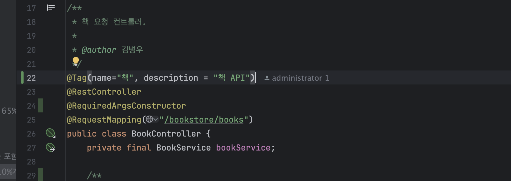
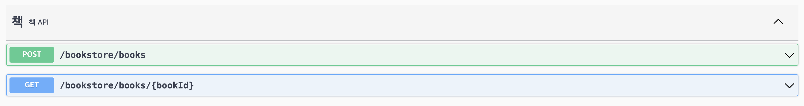
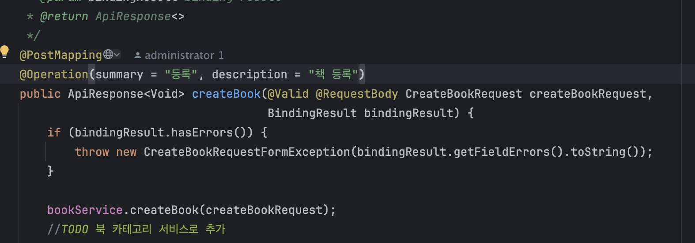
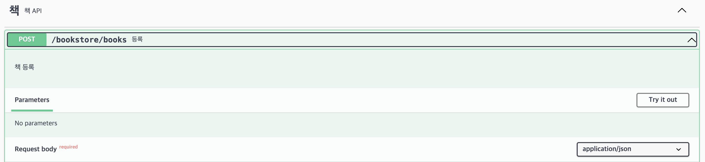
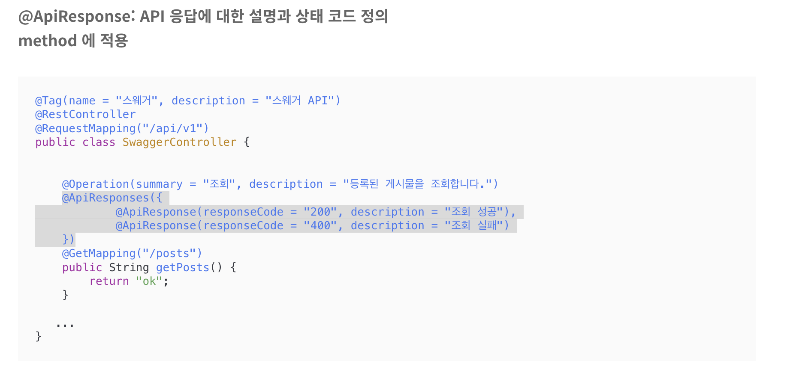
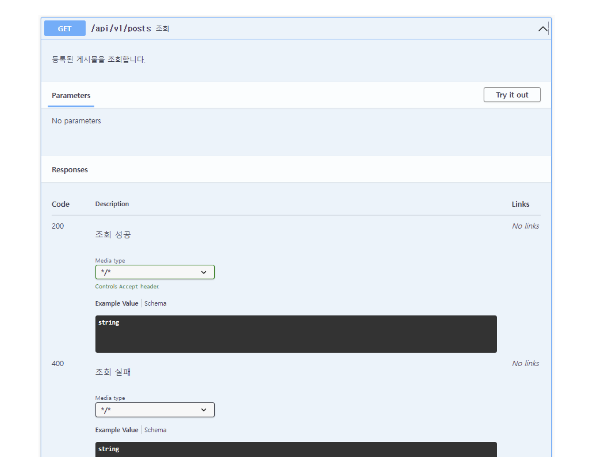
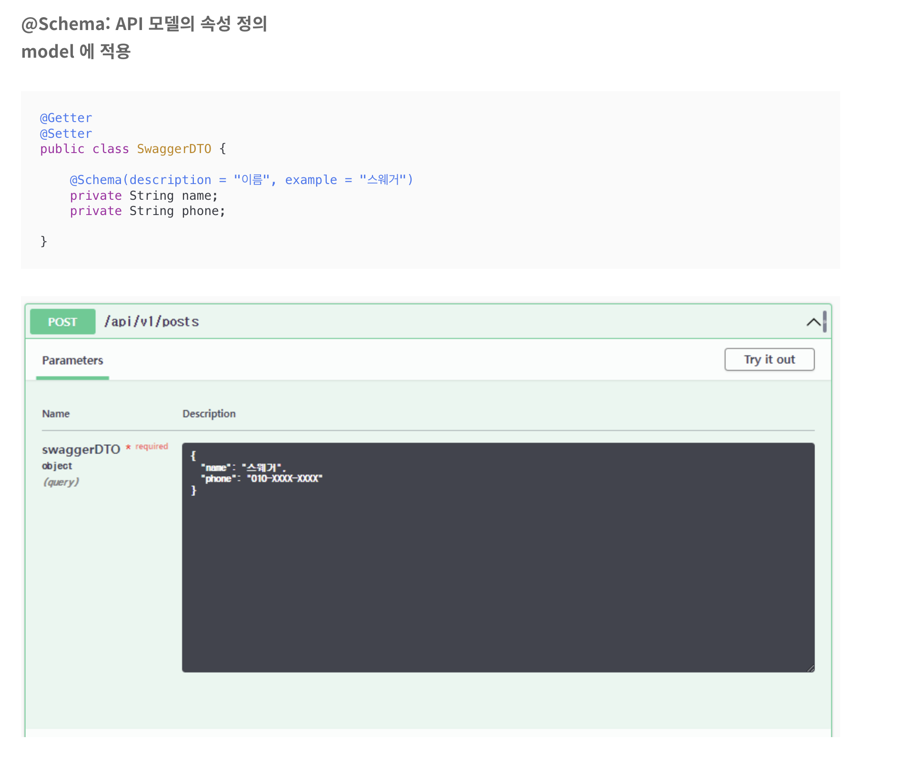

# Swagger

## 먼저 Swagger 란

- Swagger는 API를 문서화하고 테스트할 수 있는 오픈 소스 프레임워크이다.
- 어노테이션을 통해 간편하게 API 문서를 자동으로 만들 수 있다.
- 자체적으로 사용자 친화적인 UI도 제공해주고 있기 때문에 문서를 쉽게 읽고 테스트할 수 있다.
문서화에 사용되는 어노테이션이 프로덕션 코드에 존재하기에 가독성을 떨어뜨리는 단점도 존재한다. API 스펙이 변했을 때 어노테이션 메타 
데이터를 적절하게 바꿔주지 않으면 잘못된 정보를 전달할 수도 있다. 하지만 간편한 설정과 사용, 사용자 친화적인 UI는 큰 장점으로 다가온다.


### maven 에 추가
```xml
<dependency>
  <groupId>org.springdoc</groupId>
  <artifactId>springdoc-openapi-starter-webmvc-ui</artifactId>
  <version>2.2.0</version>
</dependency>
```

maven 에 추가하면 사이트에서 api 를 확인할 수 있다.
<hr>

### port가 8081 일때 스웨거 확인
http://localhost:8081/swagger-ui/index.html

<br><br><hr>

## @Tag   controller 에 적용

<br>
<hr>

## 적용 후 모습

<br><hr>

## @Operation: API 엔드 포인트 정의   method 에 적용

<br><hr>

## 적용 후 모습


<br><hr>

## @ApiResponse: API 응답에 대한 설명과 상태 코드 정의  method 에 적용


### 근데 이건 우리에게 적용하려면 현재 사용하고 있는 ApiResponse<T>를 수정해야함.. 이름이 동일해서,,
<br><hr>

## 적용 후 모습

<br><hr>

## @Schema: API 모델의 속성 정의    model 에 적용

<br><hr>


#### 출처 입니다.
>참고 : https://padosol.tistory.com/91