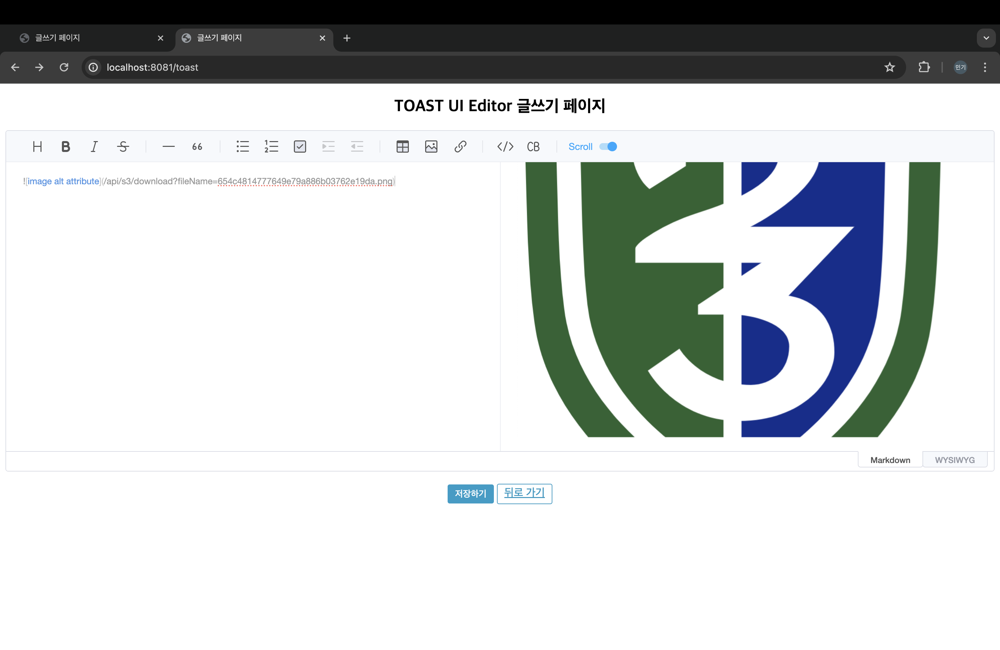

# WYSIWYG Editor 기술공유

## 1. WYSIWYG Editor(위지윅 에디터)란

WYSIWYG는 What You See Is What You Get, "보는 대로 얻는다"라는 문장의 줄임말입니다. 
문서를 편집하는 과정에서 화면에 보이는 문장이나 글 맵시 등을 동일하게 화면에 출력해주는 방식입니다. 
위지위그 에디터는 이러한 기능을 위해서 사용자는 모르게 다양한 HTML 소스를 입력해주고 있습니다.


예시 화면


> 여러가지 유로, 무료 위지윅 에디터가 있지만 우리는 NHN의 Toast Ui 를 사용해 보자

## 2. Toast Ui 사용법

TOAST UI Editor(이하 'TUI 에디터')는 NHN Cloud에서 개발한 오픈 소스 라이브러리로, 마크다운과 위지윅 방식 모두를 지원하는 무료 에디터입니다.

마크다운(Markdown) : '일반 텍스트 기반의 경량 마크업 언어'로, 일반적인 텍스트로 서식이 있는 문서를 작성하는 데 사용되는 언어입니다

위지윅(WYSIWYG) : 수동으로 텍스트를 입력하는 문서 작성의 진입장벽을 줄이기 위해 탄생한, GUI로 문서를 작성할 수 있는 도구입니다. 우리가 웹 사이트 
게시판에서 흔히 볼 수 있는 에디터가 위지윅 방식의 에디터입니다.

### 2.1 TOAST UI Editor 적용하기

사이트에 TUI 에디터를 적용하려면, TUI 에디터에서 제공해 주는 JS(JavaScript) 파일과 CSS 파일이 필요한데요. 이때 npm을 통해 소스 코드를 설치하는 방법과, CDN을 통해 소스 코드를 불러오는 방법이 있습니다.

하지만 npm을 통한 설치는 Node.js 환경에서만 가능하고, 이 글에서는 순수 javaScript를 기준으로 설명드리기 때문에 CDN을 통해 소스 코드를 불러오는 방법을 이용합니다.

<hr>

### JavaScript 소스 코드 불러오기 (CDN)
```html
<body>
    <link rel="stylesheet" href="https://uicdn.toast.com/editor/latest/toastui-editor.min.css" />
</body>
```

먼저 js 파일입니다. HTML에서 CDN으로 아래 주소에 있는 파일을 불러와야 JavaScript 코드를 통해 TUI 에디터 객체를 생성할 수 있습니다.

<hr>

### CSS 소스 코드 불러오기 (CDN)
```html
<head>
  ...
  <!-- Editor's Style -->
  <link rel="stylesheet" href="https://uicdn.toast.com/editor/latest/toastui-editor.min.css" />
</head>
```

<hr>

### body 에 div 태그 선언하기

```html
...
<body>
  <div id="content"></div>
</body>
...
```
TUI 에디터는 div 태그에 에디터가 생성(적용)되기 때문에, HTML body 태그에 div 태그를 꼭 선언해 주어야 합니다.

<hr>

### 인스턴스 생성하기
```html
...
<body>
    ...
    <script src="https://uicdn.toast.com/editor/latest/toastui-editor-all.min.js"></script>
    <script>
        const editor = new toastui.Editor({
            el: document.querySelector('#content'), // 에디터를 적용할 요소 (컨테이너)
            height: '500px',                        // 에디터 영역의 높이 값 (OOOpx || auto)
            initialEditType: 'markdown',            // 최초로 보여줄 에디터 타입 (markdown || wysiwyg)
            initialValue: '내용을 입력해 주세요.',     // 내용의 초기 값으로, 반드시 마크다운 문자열 형태여야 함
            previewStyle: 'vertical'                // 마크다운 프리뷰 스타일 (tab || vertical)
        });
    </script>
</body>
...
```
마지막으로 new 생성자를 통해 에디터 객체를 생성하면, content 라는 id를 가진 div 태그에 에디터가 적용됩니다.

<hr>

### button 추가해서 post 보내기


```html
<form id="editorForm" action="/toast" method="POST">
    <input type="hidden" id="editorContent" name="content" />
    <button type="submit">완료</button>
</form>

...

<script>
    document.getElementById('editorForm').addEventListener('submit', function(event) {
        // 에디터의 내용을 숨겨진 필드에 복사
        const editorContent = editor.getMarkdown(); // 또는 editor.getHtml();
        document.getElementById('editorContent').value = editorContent;
    });
</script>
```

<hr>

## 전체 코드 

```html
<!DOCTYPE html>
<html lang="ko">
<head>
    <meta charset="UTF-8">
    <title>TOAST UI Editor 적용하기</title>

    <!-- TUI 에디터 CSS CDN -->
    <link rel="stylesheet" href="https://uicdn.toast.com/editor/latest/toastui-editor.min.css" />
</head>
<body>
<h2 style="text-align: center;">Hello, TOAST UI Editor!</h2>

<!-- 에디터를 적용할 요소 (컨테이너) -->
<div id="content"></div>

<!-- 숨겨진 폼 필드 -->
<form id="editorForm" action="/toast" method="POST">
    <input type="hidden" id="editorContent" name="content" />
    <button type="submit">완료</button>
</form>

<!-- TUI 에디터 JS CDN -->
<script src="https://uicdn.toast.com/editor/latest/toastui-editor-all.min.js"></script>
<script>
    const editor = new toastui.Editor({
        el: document.querySelector('#content'), // 에디터를 적용할 요소 (컨테이너)
        height: '500px',                        // 에디터 영역의 높이 값 (OOOpx || auto)
        initialEditType: 'markdown',            // 최초로 보여줄 에디터 타입 (markdown || wysiwyg)
        initialValue: '내용을 입력해 주세요.',     // 내용의 초기 값으로, 반드시 마크다운 문자열 형태여야 함
        previewStyle: 'vertical'                // 마크다운 프리뷰 스타일 (tab || vertical)
    });

    // 폼 제출 이벤트 리스너 추가
    document.getElementById('editorForm').addEventListener('submit', function(event) {
        // 에디터의 내용을 숨겨진 필드에 복사
        const editorContent = editor.getMarkdown(); // 또는 editor.getHtml();
        document.getElementById('editorContent').value = editorContent;
    });
</script>
</body>
</html>
```

<hr><br><hr>

## 3. Toast Ui 문제점


이미지 업로드 시, 파일 정보가 base64라는 방식으로 인코딩(암호화) 되는데, 이때 에디터의 내용이 적게는 1,000 단위에서 길게는 10,000 ~ 100,000 단위까지 길어질 수 있다

그래서 파일을 디스크에 따로 저장해야 한다.
REST Controller 를 사용하여 upload, download 해야 한다.

<hr>

### 해결법 addImageBlobHook으로 이미지 업로드 로직 커스텀하기

먼저 이전 script const editor 에 hooks 를 추가한다.

```html
<script>
    const editor = new toastui.Editor({
        el: document.querySelector('#content'), // 에디터를 적용할 요소 (컨테이너)
        height: '500px',                        // 에디터 영역의 높이 값 (OOOpx || auto)
        initialEditType: 'markdown',            // 최초로 보여줄 에디터 타입 (markdown || wysiwyg)
        initialValue: '내용을 입력해 주세요.',     // 내용의 초기 값으로, 반드시 마크다운 문자열 형태여야 함
        previewStyle: 'vertical',                // 마크다운 프리뷰 스타일 (tab || vertical)
        hooks: {
            async addImageBlobHook(blob, callback) { // 이미지 업로드 로직 커스텀
                try {
                    /*
                     * 1. 에디터에 업로드한 이미지를 FormData 객체에 저장
                     *    (이때, 컨트롤러 uploadEditorImage 메서드의 파라미터인 'image'와 formData에 append 하는 key('image')값은 동일해야 함)
                     */
                    const formData = new FormData();
                    formData.append('image', blob);


                    // 2. FileApiController - uploadEditorImage 메서드 호출
                    const response = await fetch('/api/s3/upload', {
                        method : 'POST',
                        body : formData,
                    });


                    // 3. 컨트롤러에서 전달받은 디스크에 저장된 파일명
                    const filename = await response.text();
                    console.log('서버에 저장된 파일명 : ', filename);
                    formData.append('filename', filename)

                    // 4. addImageBlobHook의 callback 함수를 통해, 디스크에 저장된 이미지를 에디터에 렌더링

                    const imageUrl = `/api/s3/download?fileName=${filename}`;
                    callback(imageUrl, 'image alt attribute');


                } catch (error) {
                    console.error('업로드 실패 : ', error);
                }
            }
        }
    });
</script>
```

<br>

#### POST /api/s3/upload 로 image 를 보내어 서버 경로에 저장하고
#### GET /api/s3/download 에서 fileName 을 보내어 서버 경로에서 image 를 가져온다

<br>
<hr>

```java

@RestController
@RequestMapping("/api/s3")
public class ImageController {
    
    //저장할 파일의 위치
    private final String uploadDir = "/Users/hanmingi/Desktop/test/wysiwyg/image";
    

    @PostMapping("/upload")
    public String uploadEditorImage(@RequestBody final MultipartFile image) {
        if (image.isEmpty()) {
            return "";
        }

        String orgFilename = image.getOriginalFilename();                                         // 원본 파일명
        String uuid = UUID.randomUUID().toString().replaceAll("-", "");           // 32자리 랜덤 문자열
        String extension = orgFilename.substring(orgFilename.lastIndexOf(".") + 1);  // 확장자
        String saveFilename = uuid + "." + extension;                                             // 디스크에 저장할 파일명
        String fileFullPath = Paths.get(uploadDir, saveFilename).toString();                      // 디스크에 저장할 파일의 전체 경로

        // uploadDir에 해당되는 디렉터리가 없으면, uploadDir에 포함되는 전체 디렉터리 생성
        File dir = new File(uploadDir);
        if (dir.exists() == false) {
            dir.mkdirs();
        }

        try {
            // 파일 저장 (write to disk)
            File uploadFile = new File(fileFullPath);
            image.transferTo(uploadFile);
            return saveFilename;

        } catch (IOException e) {
            // 예외 처리는 따로 해주는 게 좋습니다.
            throw new RuntimeException(e);
        }
    }

    /**
     * 디스크에 업로드된 파일을 byte[]로 반환
     *
     * @param filename 디스크에 업로드된 파일명
     * @return image byte array
     */

    @GetMapping(value = "/download", produces = { MediaType.IMAGE_GIF_VALUE, MediaType.IMAGE_JPEG_VALUE, MediaType.IMAGE_PNG_VALUE })
    public byte[] printEditorImage(@RequestParam final String filename) {
        // 업로드된 파일의 전체 경로
        String fileFullPath = Paths.get(uploadDir, filename).toString();

        // 파일이 없는 경우 예외 throw
        File uploadedFile = new File(fileFullPath);
        if (!uploadedFile.exists()) {
            throw new RuntimeException();
        }

        try {
            // 이미지 파일을 byte[]로 변환 후 반환
            return Files.readAllBytes(uploadedFile.toPath());

        } catch (IOException e) {
            // 예외 처리는 따로 해주는 게 좋습니다.
            throw new RuntimeException(e);
        }
    }
}
```

<hr>

### Image 문제점 해결

사진은 경로에 따로 저장되고 api 를 통해 사진을 가져온다.




#### 하지만 이대로 서버에 바로 저장하면 여러가지 문제가 있다. 그래서 서버에 바로 저장히지 않고 object storage 와 같은 다른 곳에 저장하는 방법을 사용한다.

> 참고 : https://velog.io/@dudgus1670/WYSIWYG-Editor
> 
> 참고 : https://congsong.tistory.com/68?category=1079110
> 
>참고 : https://congsong.tistory.com/67
